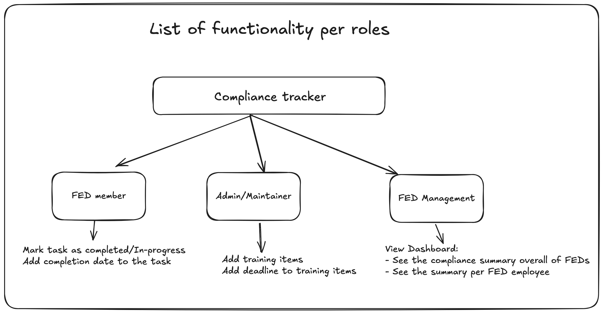
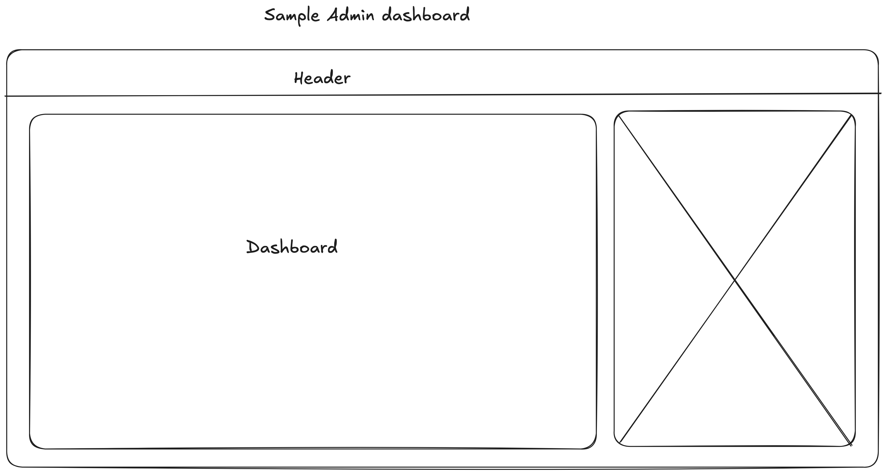
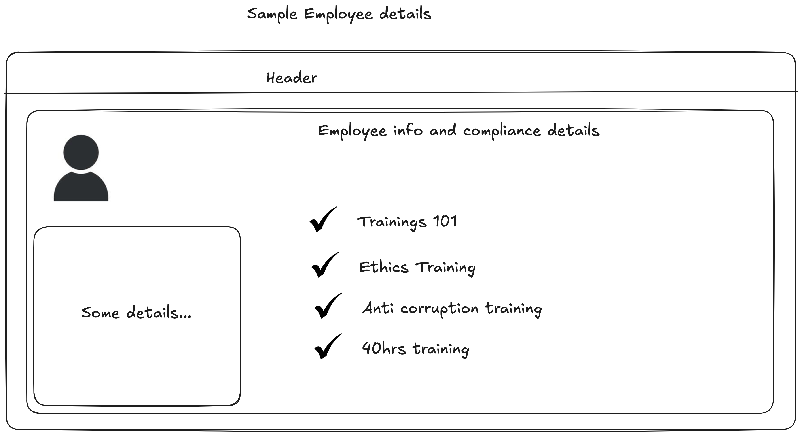

# 🌟 **FED Compliance Tracker** 🚀

## 🛠️ **Run Locally Like a Pro**

### 📂 **Step 1: Clone the Repo**

First, grab the code. It's giving _git gud_ vibes. 🖥️

```bash
$ git clone git@github.com:mestaciodel/compliance-tracker.git
```

### 📦 Step 2: Install the Dependencies

```bash
$ npm install
```

### ⚡ Step 3: Fire It Up!

**🎨 Running the Next.js App**

```bash
$ npm run start:next
```

App will open on http://localhost:3000

**🅰️ Running the Angular App**

```bash
$ npm run start:ng
```

App will open on http://localhost:4200

## App Overview



** Functionalities may change overtime ^^ **

### Mockups

Designs are all imaginary and concepts at this moments :)

Drawing board: https://excalidraw.com/#json=2HM39o1J5oXcSHQ-GjUH_,MZEDkmUOO1TJ4CQWCz8gRQ

**Dashboard**



**Employee Details**


